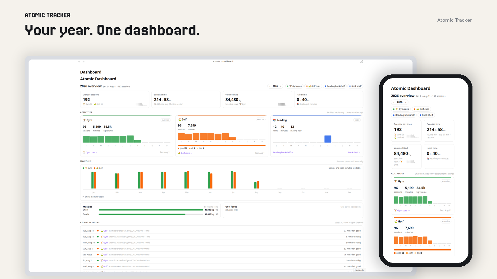
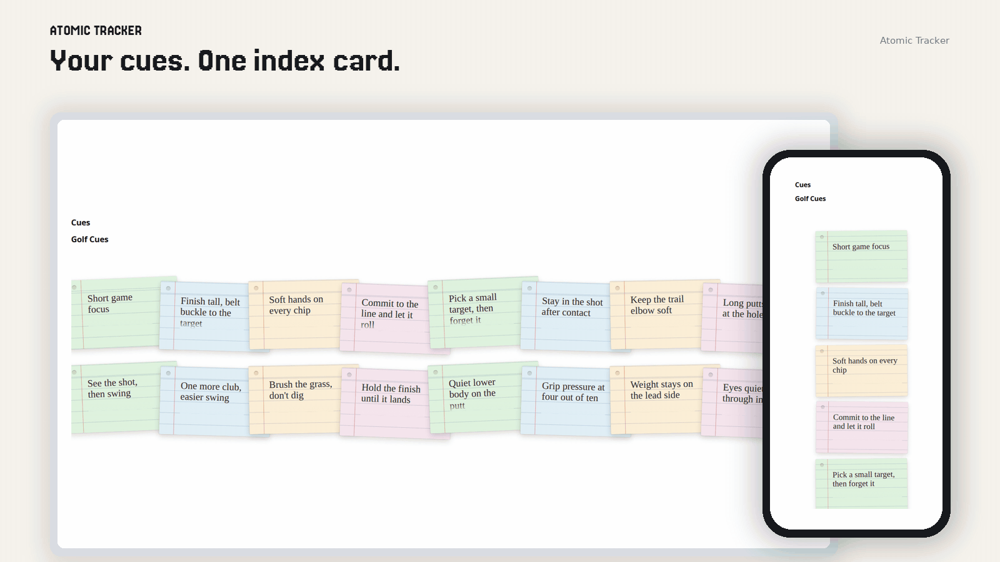

# Atomic Tracker

Habit tracking in Obsidian. Sessions, reading, heatmaps, one daily note.

**Guide:** [docs/USER_GUIDE.md](docs/USER_GUIDE.md)

**Install:** Community plugins (when listed), or copy `main.js`, `manifest.json`, and `styles.css` from the [latest GitHub Release](https://github.com/justinw0ng/obsidian-atomic/releases/latest) into `.obsidian/plugins/atomic-tracker/`. Do not use “Source code (zip)”. After an update, Atomic shows a short What's new notification once. Step-by-step: [user guide](docs/USER_GUIDE.md#install-atomic-tracker).


## Dashboard

KPI cards, per-habit activity, a monthly chart, and recent sessions. Open `atomics/Dashboard.md` or **Open dashboard**.



## Cue cards

Every cue of the year as a fanned stack of index cards. Hover to preview, then click (or tap) to move the card to the center of the screen. Add a cue from the form on a session note.



Copy-paste notes: [examples/daily-notes](examples/daily-notes) · [examples/templates](examples/templates) · [examples/dashboard](examples/dashboard)

Daily note template setup: [examples/README.md](examples/README.md#use-the-daily-note-template).

## What it does

- Exercise sessions and custom habits: enable/disable, one color picker → four heatmap shades
- Gym set log (`atomic-gym-log`): pick an exercise, enter weight and reps, click Add set. You don't type the table row yourself
- Cue log (`atomic-cue-log`): type multiline markdown (English or Traditional Chinese) on a session note and click Add cue; logged cues show as the same index cards as the cue page
- Cue pages (`atomic-cues` with `activity:`): every cue of the year as an index card in a fanned stack; hover previews, click or tap opens a centered card that grows with the cue and scrolls if it is taller than the window
- Exercise date notes (gym, golf, and peers) include a start/stop timer that writes `duration_min`
- Reading items with timers, book shelf, and Bases
- Heatmaps filterable with `activity: …`, optional 2×2 grid (`columns`, `rows`, …)
- Yearly dashboard: KPI cards, per-habit activity cards, monthly chart, and recent sessions
- Property dropdowns for Reading `status`, golf `felt`/`location`, gym `location`/`weight_unit` (`location` also allows Custom…)

Settings → Atomic Tracker → Language: English (`en`, default) or Traditional Chinese & English (`zh-Hant-en`). Changing language never rewrites existing notes. Saved language is kept on existing installs.

## Default vault layout

```text
atomics/
├── Dashboard.md
├── exercise/
│   ├── Gym/
│   │   ├── Cues.md
│   │   └── YYYY/YYYY-MM-DD.md
│   └── Golf/
│       ├── Cues.md
│       └── YYYY/YYYY-MM-DD.md
└── hobbies/
    └── Reading/
        ├── Bookshelf.base
        ├── Book Shelf.md
        ├── Covers/
        └── Items/<Book>.md
```

## Privacy

Atomic Tracker runs locally in your vault. It does not collect telemetry, require an account, or show ads. It does not call home. The only network fetch is if you set a book `cover` to an `http(s):` URL, which Obsidian loads like any other remote image in a note. It reads and writes notes under `atomics/` and any other vault paths you configure (dashboard, activity folders, book covers).

## License

Licensed under the [Apache License 2.0](LICENSE).
