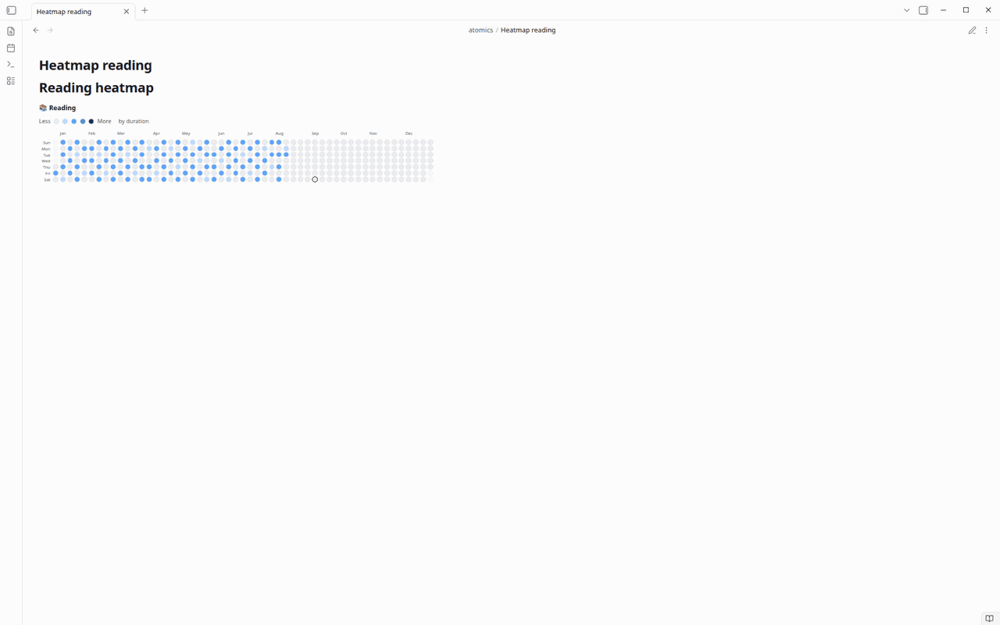
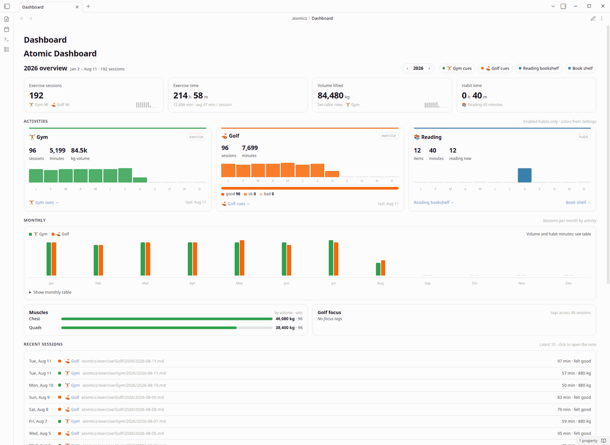

# Atomic Tracker — user guide

Atomic Tracker records exercise, reading, and other habits in your Obsidian vault. Each topic below is one thing you can do. Watch the clip, then do the same in your vault.

Clips live in [`docs/images/`](./images/). They were captured on Linux in **Light** mode with **Readable line length** off. macOS and Windows look the same aside from window chrome. Book-shelf and Reading clips use original typographic demo covers with invented titles, not publisher artwork.

Session data is plain markdown under `atomics/**`. Nothing is sent over the network.

Rendered views (heatmap, dashboard, book shelf, timer, gym set log, cues) do not show an “Atomic Tracker …” heading above the UI. The plugin name stays in Settings and in command palette prefixes only.

---

## What Atomic Tracker does

| You want to | Use |
|-------------|-----|
| See a year of work | `atomic-heatmap` |
| See today’s sessions | `atomic-today` |
| See the year as cards and totals | `atomic-dashboard` |
| Start a gym or golf session | `atomic-actions`, or **New gym session** / **New golf session** |
| Time a gym or golf session | `atomic-timer` on the date note — writes `duration_min` |
| Log a gym set | Pick an exercise, enter weight and reps, click **Add set** |
| Keep a cue you will reuse | `atomic-cue-log` on the session note, then `atomic-golf-cues` / `atomic-gym-cues` / `atomic-cues` |
| Track a book or other item habit | **New reading item** (or **New hobby item**) plus `atomic-timer` |
| See books on a shelf | `atomic-bookshelf`, or **Open book shelf** |
| Browse Reading notes in Bases | **Open reading Bases** |
| Fill Properties without typing | Dropdowns for Reading `status`, golf `felt`, gym/golf `location` (preset or **Custom…**), gym `weight_unit` |

---

## Install Atomic Tracker

1. Download Obsidian from [obsidian.md/download](https://obsidian.md/download) and create or open a vault.
2. **Settings → Community plugins**. Turn off **Restricted mode** if you see it, and confirm any trust prompt.
3. Install the plugin (community listing when available, or the three GitHub Release files below).
4. Find **Atomic Tracker** and toggle it on.


After you **update** Atomic Tracker to a new version, a short **What's new** notification appears once (the same live toast Obsidian uses for other plugin messages). It dismisses on its own. It does not show again until a later version ships another note. The body follows **Settings → Language**: English when Language is English; Cantonese Traditional Chinese when Language is Traditional Chinese & English.

### Manual install from a GitHub Release

For end users who are not building from source:

1. Open the [latest GitHub Release](https://github.com/justinw0ng/obsidian-atomic/releases/latest).
2. Download **`main.js`**, **`manifest.json`**, and **`styles.css`**.
3. Copy those three files into `<vault>/.obsidian/plugins/atomic-tracker/`. Create the folder if it does not exist.

Do **not** use GitHub’s “Source code (zip)” or any `.zip` asset. Releases do not publish an `atomic-tracker-*.zip`. Obsidian needs those three files sitting in the `atomic-tracker` plugin folder; a source zip is the wrong artifact.

On your machine the folder is `<your-vault>/.obsidian/plugins/atomic-tracker/` with the same three files.

### Build this plugin from source

For developers who want to compile locally:

```bash
npm install
npm run build
```

Copy `main.js`, `manifest.json`, and `styles.css` into `<vault>/.obsidian/plugins/atomic-tracker/`.

Optional one-shot copy while building:

```bash
OBSIDIAN_PLUGIN_OUT=/path/to/vault/.obsidian/plugins/atomic-tracker npm run build
```

For development, symlink the repo into the vault plugins folder:

```bash
mkdir -p /path/to/vault/.obsidian/plugins
ln -sfn "$(pwd)" /path/to/vault/.obsidian/plugins/atomic-tracker
npm run build
```

---

## Choose your habits

Open **Settings → Atomic Tracker**. Enable the habits you actually do. One color picker per habit becomes the four heatmap shades (light → dark). Disable a habit to hide it from heatmaps, the dashboard, and commands without deleting notes. Delete removes it from settings only (Reading is not force-added back afterward).


| Setting | Default | Purpose |
|---------|---------|---------|
| Language | English (`en`) | Plugin UI language. Options are English or Traditional Chinese & English (`zh-Hant-en`); existing notes are not rewritten. Saved language is kept on existing installs |
| Timezone | `Asia/Hong_Kong` | “Today” and new session dates |
| Dashboard path | `atomics/Dashboard.md` | Target of **Open dashboard** |
| Exercise types | Gym, Golf | Enable/disable, label, folder, cues, **one color**, delete; add custom exercises |
| Gym exercises | empty until you log or import | Exercises for the dropdown; **Import from gym notes** remembers old ones and adds the form to old gym notes |
| General habits | Reading | Enable/disable, label, folder, **one color**, delete; add custom item+timer habits |

Exercise folders default to `atomics/exercise/Gym` and `atomics/exercise/Golf`. Reading defaults to `atomics/hobbies/Reading` with item notes under `Items/`.

Language only changes plugin chrome, prompts, notices, command names after reload, and templates created after the change. There is no Simplified Chinese or Chinese-only mode.

### Vault layout

```text
Vault/
├── atomics/
│   ├── Dashboard.md
│   ├── exercise/
│   │   ├── Gym/
│   │   │   ├── Cues.md
│   │   │   └── YYYY/
│   │   │       └── YYYY-MM-DD.md
│   │   └── Golf/
│   │       ├── Cues.md
│   │       └── YYYY/
│   │           └── YYYY-MM-DD.md
│   └── hobbies/
│       └── Reading/
│           ├── Bookshelf.base
│           ├── Book Shelf.md
│           ├── Covers/
│           │   └── title.jpg
│           └── Items/
│               └── The Unhurried Advantage.md
└── .obsidian/plugins/atomic-tracker/
    ├── main.js
    ├── manifest.json
    └── styles.css
```

A daily-note composition (book shelf, actions, 2×2 heatmaps, today) is in [`examples/daily-notes/2026-08-11.md`](../examples/daily-notes/2026-08-11.md). The reusable Obsidian template is [`examples/templates/Atomic daily note.md`](../examples/templates/Atomic%20daily%20note.md). Setup: [examples/README.md](../examples/README.md#use-the-daily-note-template).

---

## See a year of habits

`atomic-heatmap` paints one year of minutes so you can see streaks and gaps. It shows **all enabled** habits by default. Narrow it with `activity:`.


Newly created UI blocks include every option as a comment. Uncomment a line to use it; lines that start with `#` are ignored.

````markdown
```atomic-heatmap
# Uncomment a line to use it. Lines that start with # are ignored.
year: 2026  # calendar year. Omit to use a YYYY-MM-DD note path, or this year
# activity: all  # all, one id, or comma list (gym, golf). Default: all enabled habits
# rows: 1  # preferred rows for several heatmaps. Default: 1
# columns: 1  # max columns; 1 stacks vertically. Default: 1
# min-column-width: 300  # wrap below this column width in px. Default: 300
# default-span: 1.2  # relative width of each heatmap column. Default: 1.2
```
````

Watch the same year filtered to Reading, then Gym + Golf, then all three:



````markdown
```atomic-heatmap
activity: reading
year: 2026
```

```atomic-heatmap
activity: gym, golf
year: 2026
```

```atomic-heatmap
activity: gym, golf, reading
rows: 2              # default: 1
columns: 2           # default: 1
min-column-width: 300  # default: 300
default-span: 1.2      # default: 1.2
year: 2026
```
````

Use `activity: all` (or omit the field) for every enabled exercise + general habit. Unknown or disabled ids show a short notice; valid ids in the list still render.

With multiple activities, `columns` greater than `1` lays out heatmaps in a responsive grid (`.fitness-heatmap-grid`) that wraps when the pane is narrower than `columns × min-column-width`. `columns: 1` (default) keeps a vertical stack.

On a narrow pane the year grid scrolls horizontally (scrollbar hidden) so every day cell stays a full circle. Today is a ring on that day’s circle: **black in light mode**, **white in dark mode**.

| Option | Default | Meaning |
|--------|---------|---------|
| `rows` | `1` | Preferred row count for the grid |
| `columns` | `1` | Max columns (`1` = vertical stack) |
| `min-column-width` | `300` | Minimum px width per column before wrapping |
| `default-span` | `1.2` | CSS `fr` weight for each grid track |

---

## See today

`atomic-today` lists today’s gym, golf, and other exercise sessions so you can open the note you need.


````markdown
```atomic-today
# Uncomment a line to use it. Lines that start with # are ignored.
# date: 2026-08-08  # YYYY-MM-DD. Omit to use the note path date, or today
```
````

---

## See the year on one page

Open `atomics/Dashboard.md` with **Atomic Tracker: Open dashboard**, or paste an `atomic-dashboard` fence into any note. Use Reading view. `year:` in the fence wins, then the note’s `year` property, then this calendar year. The `‹ ›` switcher only changes the on-screen year; it does not edit the note.



Same note as [`examples/dashboard/Dashboard.md`](../examples/dashboard/Dashboard.md):

````markdown
---
year: 2026
---

# Atomic Dashboard

```atomic-dashboard
# Uncomment a line to use it. Lines that start with # are ignored.
year: 2026  # calendar year. Omit to use the note year property, or this year
```
````

The block is a stack of cards for that year:

- **Header** — `{year} overview`, the date range and session count, a `‹ ›` year switcher, and chips that open Gym/Golf cues or reading Bases.
- **KPI cards** — exercise sessions and exercise time when any exercise habit is enabled (sessions include a monthly sparkline). **Volume lifted** appears when a set-table habit such as Gym has logged sets. **Habit time** appears when a timer habit such as Reading has minutes.
- **Activity cards** — one card per enabled habit. Exercise cards show sessions, minutes, optional volume, monthly bars sized by hours that month, last session date, and a cues link. Golf also shows how sessions felt. Habit cards show item count, timer minutes, monthly bars sized by hours, and Reading’s in-progress count plus Bases and book shelf links.
- **Monthly** — grouped bars of sessions per month by activity. Open **Show monthly table** for the exact grid, including volume (kg) and habit minutes when those apply.
- **Muscles / Golf focus** — shown only when the data exists: Gym set-table volume by muscle, and Golf focus tags across sessions.
- **Recent sessions** — latest ten notes. Click a row to open that session.

Disable a habit in Settings to drop its card, chips, and KPI contribution without deleting notes. On a narrow pane the same cards stack to one column.

---

## Start a gym or golf session

Put `atomic-actions` on a note. Every **enabled** habit appears as a button: exercise types create a daily session; general habits (Reading, Chess, …) create an item note.


````markdown
```atomic-actions
# No options. One button for each enabled habit.
```
````

Or use the command palette (`Ctrl/Cmd + P`):

1. Run **Atomic Tracker: New gym session** or **Atomic Tracker: New golf session**
2. Enter the date, then follow location / unit prompts for gym

Gym notes keep sets in a markdown table and cues under a **Reminders** heading. Golf notes store cues under **Reminders** too. Those feed the cue cards.

### Session frontmatter and property dropdowns

Gym and golf daily notes use `type: session` frontmatter. Atomic turns several fields into **dropdowns** in Properties (and in Bases table cells).

| Property | Golf sessions (`activity: golf`) | Gym sessions (`activity: gym`) |
|----------|----------------------------------|--------------------------------|
| `location` | Home net, Driving range, Course, Other — plus **Custom…** | Home, Commercial, Hotel/Travel, Other — plus **Custom…** |
| `felt` | good, ok, bad | — |
| `weight_unit` | — | kg, lb |

For `location`, pick a preset or **Custom…** at the bottom of the list. **Custom…** opens a prompt; whatever you enter is stored in `location`. When you create a gym session and choose predefined **Other**, Atomic may still ask for `location_detail` (separate from a custom `location` string).

Dropdown labels follow **Settings → Atomic Tracker → Language**. If a note already has a value outside the list, it still appears as an extra option so nothing is lost.

After updating the plugin, reload Atomic once (toggle off/on under Community plugins) if dropdowns do not appear immediately.

---

## Time a session

New gym, golf, and other exercise date notes include `atomic-timer`. **Start** / **Stop** write elapsed minutes into `duration_min` (added to whatever is already there) and clear `timer_started_at`. Stop does not prompt for a Time log note and does not add a Time log section — gym set rows stay independent.


````markdown
```atomic-timer
# No options. Start, Stop, Resume, or Discard the timer on this note.
```
````

Heatmaps and the dashboard still read `duration_min` from the date file. The timer lives on that file (`atomics/exercise/<Activity>/YYYY/YYYY-MM-DD.md`), not on the daily note.

You can still type `duration_min` by hand. Older session notes: paste the fence onto the date file (above the set table on gym notes).

---

## Log gym sets

You do not have to type each table row. New gym notes include `atomic-gym-log`.


````markdown
```atomic-gym-log
# No options. Pick an exercise, enter weight and reps, then add a set. No need to type the table row yourself.
```
````

1. Pick an **exercise** from the dropdown (ones you have logged before).
2. Enter **Weight**, **Reps**, and an optional **Notes** value.
3. Click **Add set**. A row appears in the table on the same note. The dropdown stays on that exercise so the next set is one tap away.

**New exercise…** at the bottom of the dropdown saves a new exercise so you can pick it next time. Saved exercises live in plugin settings, not in a vault note.

After you update from an older Atomic version, an **Easier gym sets** modal explains the form and offers a one-time setup: remember exercises from your old gym notes, and add this form to notes that don't have it. Choose **Later** to skip; **Settings → Atomic Tracker → Import from gym notes** does the same thing.

You can still edit the table by hand.

---

## Keep cues you will reuse

A cue is a short reminder you want again — a golf swing thought, a gym setup, anything you would otherwise lose in a bullet list. Type it on the session note. Atomic saves it as markdown and shows it as an index card.


New exercise session notes include a cue form under **Reminders**:

````markdown
```atomic-cue-log
# No options. Type a cue and add it. It is saved as a bullet under this note's Reminders heading.
```
````

1. Type the cue. Markdown and Traditional Chinese are fine; use more than one line if you need to.
2. Click **Add cue** (or press Ctrl/Cmd+Enter).

The cue is written as a `- ` bullet under **Reminders** on that note (extra lines stay indented so they belong to that one item). Older session notes: paste the fence under the note's **Reminders** heading. You can still type bullets by hand.

### Cue cards

The cue page shows **every cue of the year as one index card** in a fanned stack, newest first. A repeated cue collapses onto a single card that carries a `×n` repeat badge.

Hover a card on desktop (or tap it on a phone) and it lifts out of the fan so you can read the full cue, date, focus, and repeat count. Tap again (or move the pointer away) to drop it back. Keyboard users can Tab to a card and press Enter or Space. With **Reduce motion** on, the card still reveals the cue, just without the lift.


A follow-up build enlarges the card to the center of the pane with a blur-only backdrop (no dim overlay). This clip matches that upcoming popup:


`atomics/exercise/Golf/Cues.md`:

````markdown
# Golf Cues

```atomic-golf-cues
# Uncomment a line to use it. Lines that start with # are ignored.
year: 2026  # calendar year. Omit to use the note year property, or this year
```
````

`atomics/exercise/Gym/Cues.md`:

````markdown
# Gym Cues

```atomic-gym-cues
# Uncomment a line to use it. Lines that start with # are ignored.
year: 2026  # calendar year. Omit to use the note year property, or this year
```
````

Generic cue rollup (`activity` is required):

````markdown
```atomic-cues
# Uncomment a line to use it. Lines that start with # are ignored.
activity: golf  # required: golf, gym, or another exercise id
# year: 2026  # calendar year. Omit to use the note year property, or this year
```
````

---

## Track reading

**Reading / 睇書** is the default general habit (item notes + timer). You can disable or delete it in settings, and add other general habits the same way (for example Chess under `atomics/hobbies/Chess`).

1. Run **Atomic Tracker: New reading item** (Reading only), or **Atomic Tracker: New hobby item** and pick an enabled general habit.
2. Enter the item title.
3. Atomic creates or opens `<hobby-folder>/Items/<Title>.md`.

Frontmatter is ready for Bases:

```yaml
type: atomic-item
domain: hobby
activity: reading
status: to-read
```

`status` is one of four Reading workflow values:

| Value | Meaning |
|-------|---------|
| `to-read` | Default for new items; not started yet |
| `reading` | Currently reading |
| `to-read-again` | Finished once; plan to revisit |
| `finished` | Done for now |

On Reading item notes, Atomic shows `status` as a **dropdown** in Properties and in Bases (same four options, localized labels). Other fields (`authors`, `description`, `cover`, …) stay normal text or list properties.

```yaml
authors:
  - ""
description: ""
pages:
cover: "[[atomics/hobbies/Reading/Covers/title.jpg]]"
tags:
  - books
spine_color:
total_min: 0
timer_started_at:
related_canvas:
```

`cover` accepts a vault wikilink, vault-relative path, or `http(s):` / `app://` image URL. Put local art under `atomics/hobbies/Reading/Covers/` (or any vault path). Empty `cover` uses `spine_color` / a hashed color with the title (long titles wrap and shrink on the shelf).

Use **Remarks** for notes. **Time log** is managed by the timer.

---

## Time your reading

Reading item notes include the same `atomic-timer` block. **Stop** asks for a short note, clears `timer_started_at`, increments `total_min`, and appends a time-log bullet. Those minutes feed the heatmap and the dashboard.


````markdown
```atomic-timer
# No options. Start, Stop, Resume, or Discard the timer on this note.
```
````

Exercise date notes use the same block but write `duration_min` instead (see [Time a session](#time-a-session)).

---

## See your books on a shelf

Run **Atomic Tracker: Open book shelf**. Atomic Tracker creates `atomics/hobbies/Reading/Book Shelf.md` if missing. Hover (or tap once on a phone) rolls a cover open. Desktop click opens the book note; on a phone, a second tap opens the note.


````markdown
```atomic-bookshelf
# Uncomment a line to use it. Lines that start with # are ignored.
activity: reading  # habit id (enabled item habit with a timer). Default: reading
# status: all  # all, or to-read, reading, to-read-again, finished. Default: all
# scale: 1  # book size vs default, 0.25–4. Default: 1. Alias: ratio
```
````

The clip uses the same invented demo set as the README hero (`docs/demo-covers/`). Your vault can use any local or remote cover image.

**Filter by status** (optional). Omit `status` or use `status: all` to show every book. Otherwise only items whose frontmatter `status` matches are shown:

````markdown
```atomic-bookshelf
activity: reading
status: reading
```

```atomic-bookshelf
activity: reading
status: reading, to-read
```
````

Valid `status` values: `to-read`, `reading`, `to-read-again`, `finished`. Unknown tokens show a short notice; valid ids in the list still filter correctly.

**Scale the shelf** (optional). `scale` (or the alias `ratio`) multiplies the default book size. Omit it or use `scale: 1` for the usual cover. `0.5` is half size; `1.5` is one and a half; `2` is double. Positive values outside `0.25`–`4` are clamped to that range. Zero, negative, and non-numeric values fall back to `1`. Narrow panes still shrink books so a row can keep three covers; `scale` sets the preferred size on a wide pane.

The shelf is a plugin-rendered scene with no heading above the books. Books stand on planks. A row always keeps **at least three books**; if the pane is too narrow even at the minimum cover size, that row scrolls horizontally (scrollbar hidden) instead of wrapping to one or two books. Wider panes still wrap extra books onto the next plank. Hover/focus on a desktop pointer rolls the cover open on a spine hinge (local CSS 3D). No Framer runtime.

### Set a custom book cover

By default an empty `cover` field shows a colored spine with the title. To use your own art on the Atomic book shelf (and in Bases Cards when the view uses `cover`):

1. Add an image to the vault. Recommended folder: `atomics/hobbies/Reading/Covers/` (create it if missing). Example: `atomics/hobbies/Reading/Covers/the-unhurried-advantage.png`.
2. Open the book item note (for example `atomics/hobbies/Reading/Items/The Unhurried Advantage.md`).
3. In Properties / frontmatter, set `cover` to one of:
   - Vault wikilink: `[[atomics/hobbies/Reading/Covers/the-unhurried-advantage.png]]`
   - Vault-relative path: `atomics/hobbies/Reading/Covers/the-unhurried-advantage.png`
   - Remote or app URL: `https://…` or `app://…`
4. Save the note, then reopen or refresh **Book Shelf** (`atomic-bookshelf`) so the cover image loads on the book face.

Optional: set `spine_color` to a hex color (for example `#7c3aed`) when you want a custom spine without a cover image. If both are set, `cover` wins for the book face.

`related_canvas` is a plain frontmatter field. Drag Reading notes onto Obsidian Canvas or link them with normal wikilinks.

---

## Open reading in Bases

Run **Atomic Tracker: Open reading Bases**. Atomic Tracker creates `atomics/hobbies/Reading/Bookshelf.base` if missing, then opens it. The file seeds Bases Cards and Table views for Reading items.

Soft-requires Obsidian’s **Bases** core plugin. If Bases is disabled, Atomic shows a notice and leaves the vault unchanged.

---

## Commands

| Command | Action |
|---------|--------|
| Atomic Tracker: New gym session | Create or open `atomics/exercise/Gym/YYYY/YYYY-MM-DD.md` (Gym must be enabled) |
| Atomic Tracker: New golf session | Create or open `atomics/exercise/Golf/YYYY/YYYY-MM-DD.md` (Golf must be enabled) |
| Atomic Tracker: New exercise session | Pick an enabled exercise type, then create/open its daily note |
| Atomic Tracker: New reading item | Create or open `atomics/hobbies/Reading/Items/<Book>.md` (Reading must be enabled) |
| Atomic Tracker: New hobby item | Pick an enabled general habit, then create/open an item note |
| Atomic Tracker: Create reading Bases | Create `atomics/hobbies/Reading/Bookshelf.base` if missing (upgrades broken legacy seeds) |
| Atomic Tracker: Open reading Bases | Create if needed and open `atomics/hobbies/Reading/Bookshelf.base` |
| Atomic Tracker: Create book shelf | Create `atomics/hobbies/Reading/Book Shelf.md` if missing |
| Atomic Tracker: Open book shelf | Create if needed and open `atomics/hobbies/Reading/Book Shelf.md` |
| Atomic Tracker: Open dashboard | Open the configured dashboard path |

---

## If something looks wrong

| Problem | Fix |
|---------|-----|
| Plugin not listed | Confirm `main.js`, `manifest.json`, and `styles.css` are under `.obsidian/plugins/atomic-tracker/` and reload plugins. Do not use a source zip. |
| Restricted mode | Turn on community plugins in Settings |
| Empty heatmap / dashboard | Enable the habit in settings; add exercise sessions with `date` / `duration_min` (timer Stop writes that field), or stop a hobby timer so the item has Time log entries |
| Heatmap says unknown/disabled activities | Fix `activity:` ids, or re-enable the habit in Settings → Atomic Tracker |
| Reading notes in Bases do not open | Enable Reading in settings, enable Bases, then rerun **Atomic Tracker: Open reading Bases** |
| Wrong “today” | Set **Timezone** in Atomic Tracker settings to your IANA zone |
| Codeblock shows raw text | Enable the plugin and use Reading view (or Live Preview after reload) |
| Property dropdown missing | Reload the Atomic Tracker plugin; confirm the note type matches (Reading item vs golf/gym session) |
| Set log missing on old gym notes | Run **Import from gym notes** in Settings, or paste an `atomic-gym-log` fence above the set table |
| Session timer missing on old gym/golf notes | Paste an `atomic-timer` fence on the date note (above the set table on gym notes) |
| Book shelf empty after `status:` filter | Check item frontmatter `status` values; use `status: all` to show every book |
| Book shelf empty on phone / iOS | Wait for vault metadata to finish indexing, or reopen the note; covers stay flat on touch (open-on-hover is desktop) |
| Heatmap cells clipped on a narrow pane | Scroll the grid horizontally; day labels stay pinned |

---

## Privacy

- All data stays in your vault as markdown.
- The plugin does not call home. An `http(s):` book `cover` URL is loaded by Obsidian like any other remote image in a note.
- Build deploy to a vault happens only if you set `OBSIDIAN_PLUGIN_OUT` yourself.
