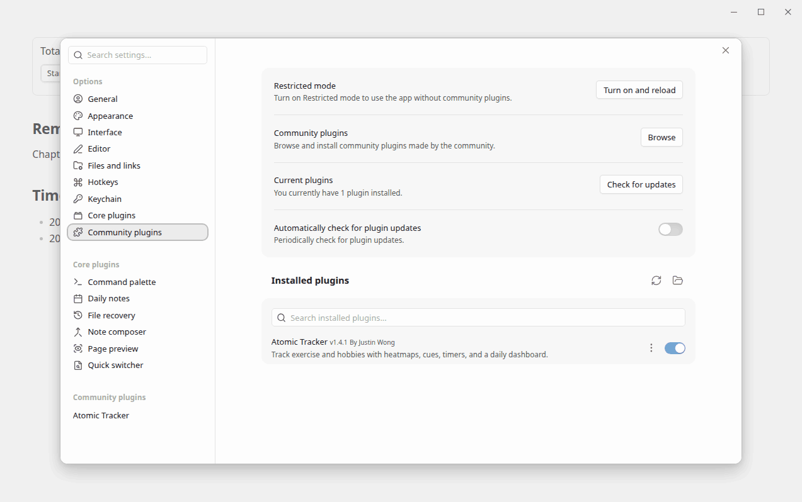
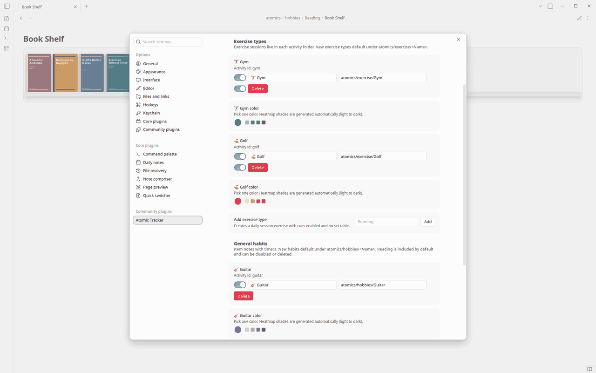
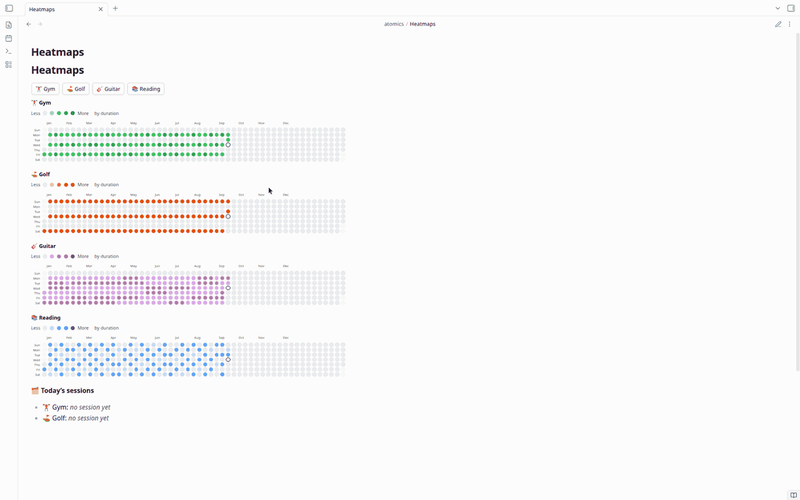
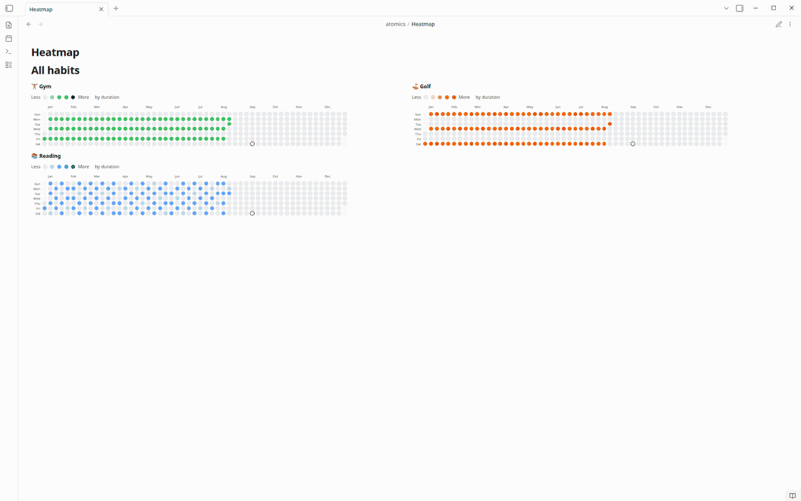
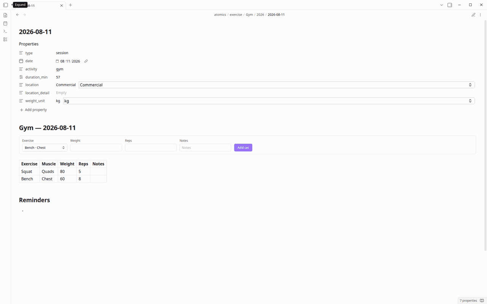
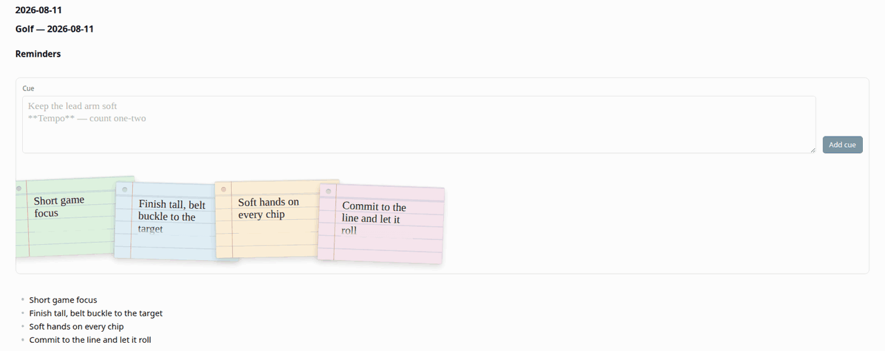
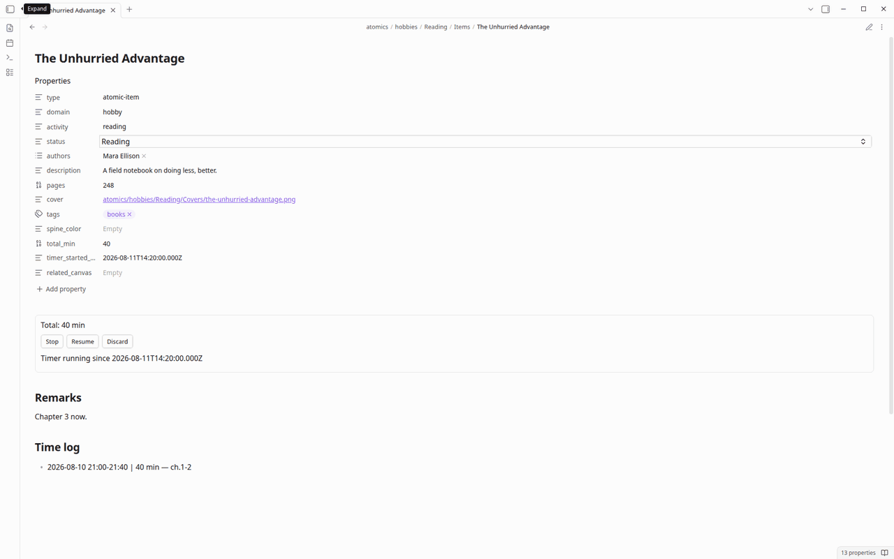
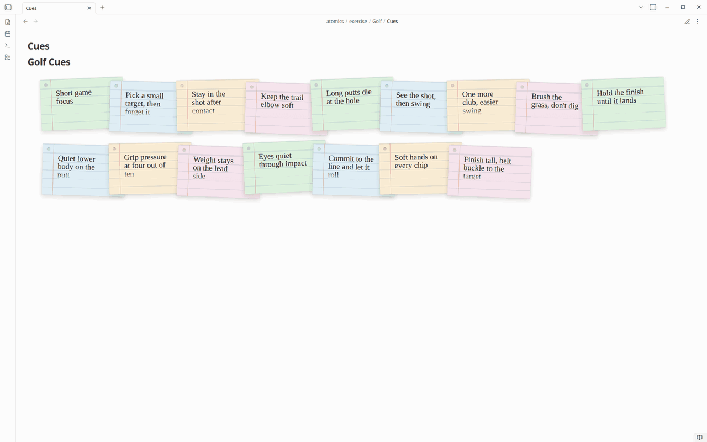
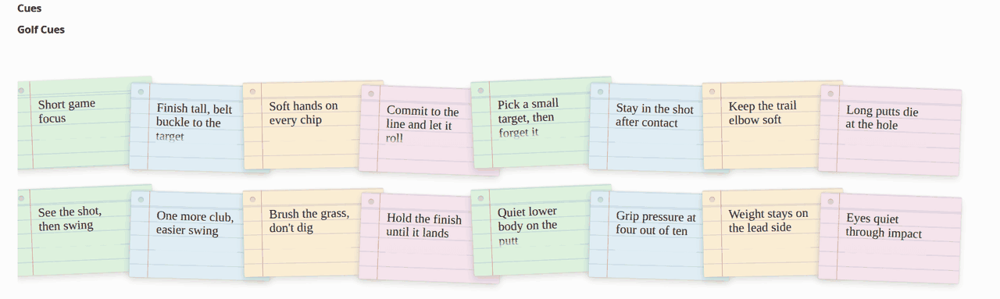
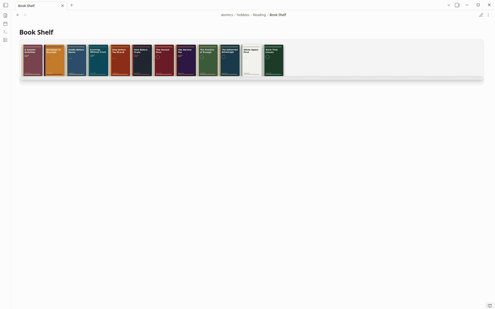

# Atomic Tracker — user guide

Atomic Tracker records gym, golf, and reading in your Obsidian vault. Everything stays as markdown. Nothing is sent over the network.

Open today’s note, use the blocks on it, then look at the cue cards and book shelf that day produced.

---

## Install Atomic Tracker

1. Download Obsidian from [obsidian.md/download](https://obsidian.md/download) and open a vault.
2. **Settings → Community plugins**. Turn off **Restricted mode** if you see it.
3. Install Atomic Tracker (community listing when available, or the three files below).
4. Find **Atomic Tracker** and toggle it on.



### Manual install from a GitHub Release

1. Open the [latest GitHub Release](https://github.com/justinw0ng/obsidian-atomic/releases/latest).
2. Download **`main.js`**, **`manifest.json`**, and **`styles.css`**.
3. Copy those three files into `<vault>/.obsidian/plugins/atomic-tracker/`. Create the folder if it does not exist.

Do **not** use GitHub’s “Source code (zip)” or any `.zip` asset. Releases do not publish an `atomic-tracker-*.zip`. Obsidian needs those three files sitting in the `atomic-tracker` plugin folder; a source zip is the wrong artifact.

---

## Open today’s note

Copy the example daily note [`examples/daily-notes/2026-08-11.md`](../examples/daily-notes/2026-08-11.md) into your vault (or use the [daily note template](../examples/templates/Atomic%20daily%20note.md) — setup is in [examples/README.md](../examples/README.md#use-the-daily-note-template)).

Open **today’s daily note**. You should see a book shelf, buttons for each habit, a year of heatmaps, and today’s sessions.

Turn on **Gym**, **Golf**, and **Reading** under **Settings → Atomic Tracker** if those buttons are missing. One color picker per habit sets the heatmap shades.



The example note is this:

````markdown
# Tuesday, August 11, 2026

```atomic-bookshelf
activity: reading
```

## Track your activities today!

```atomic-actions
```

```atomic-heatmap
year: 2026
activity: gym, golf, reading
rows: 2
columns: 2
```

```atomic-today
```
````

Press a habit button. Atomic creates **today’s session note** (gym or golf) or a **reading item**. The session note is where the timer, gym set log, and cue form live.



---

## Heatmap

The year grid on today’s note fills in as you log time. Darker cells are more minutes.



`atomic-today` lists the gym and golf notes for this date. Click a row to open that session.


---

## Timer

On the gym or golf session note, press **Start** when you begin and **Stop** when you finish. Minutes are saved on that note and show up on the heatmap.



---

## Gym log

On the gym session note, pick an exercise, enter weight and reps, then click **Add set**. A row appears in the table. You do not type the table yourself.


---

## Cues

On the same session note, type a short reminder and click **Add cue**. Atomic saves it on that note.



---

## Reading

From today’s note, press **Reading** (or click a book on the shelf). On the book note, **Start** / **Stop** the timer. Stop asks for a short note. Those minutes fill the reading heatmap.



---

## Cue cards and the shelf

Cues from today show up as cards. Hover or tap a card to read it. Click it to enlarge it in the center. The rest of the fan blurs; the page does not dim.





The shelf on today’s note is your books. Hover (or tap once on a phone) rolls a cover open. Click (or tap again) to open the book note.



---

## If something looks wrong

| Problem | Fix |
|---------|-----|
| Plugin not listed | Confirm `main.js`, `manifest.json`, and `styles.css` are under `.obsidian/plugins/atomic-tracker/` and reload plugins. Do not use a source zip. |
| Restricted mode | Turn on community plugins in Settings |
| Empty heatmap or today list | Enable the habit in settings, then stop a session timer or a reading timer |
| Codeblock shows raw text | Enable the plugin and use Reading view |

---

## Privacy

- All data stays in your vault as markdown.
- The plugin does not call home. An `http(s):` book `cover` URL is loaded by Obsidian like any other remote image in a note.
