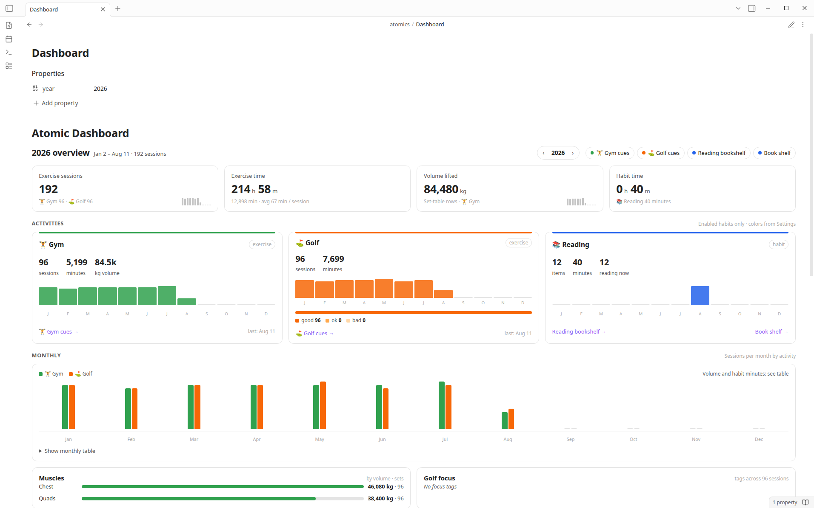

# Atomic Tracker — user guide

Step-by-step setup for the Obsidian Atomic Tracker plugin: gym and golf sessions, Reading timers, heatmaps, dashboard, cue rollups, and bookshelf views under `atomics/**`.

Screenshots live in [`docs/images/`](./images/). Captured on Linux with Obsidian in Light mode; macOS and Windows look the same aside from window chrome. Book-shelf and Reading shots use original typographic demo covers with invented titles, not publisher artwork.

---

## What you get

| Feature | How you use it |
|---------|----------------|
| Year heatmaps | `atomic-heatmap` codeblock |
| Today’s sessions | `atomic-today` codeblock |
| Yearly dashboard | `atomic-dashboard` codeblock |
| Golf cue rollup | `atomic-golf-cues` |
| Gym cue rollup | `atomic-gym-cues` |
| Generic cue rollup | `atomic-cues` with `activity: golf` or `activity: gym` |
| Quick actions | `atomic-actions`, or the command palette |
| New gym / golf notes | **Atomic Tracker: New gym session** / **New golf session** |
| Gym set log | On a gym note, pick an exercise, enter weight/reps, click Add set. The table row is written for you |
| Reading items | **Atomic Tracker: New reading item** |
| Reading timer | `atomic-timer` in a Reading item note |
| Reading notes in Bases | **Atomic Tracker: Open reading Bases** |
| Book shelf | `atomic-bookshelf`, or **Atomic Tracker: Open book shelf** |
| Property dropdowns | Dropdowns in Properties / Bases (Reading `status`; golf `felt`; gym/golf `location` preset or **Custom…**; gym `weight_unit`) |

Session data is plain markdown in your vault. Nothing is sent over the network.

Rendered views (heatmap, dashboard, book shelf, timer, gym set log, cues) do not show an “Atomic Tracker …” heading above the UI. The plugin name stays in Settings and in command palette prefixes only.

---

## 1. Install Obsidian

1. Download Obsidian from [obsidian.md/download](https://obsidian.md/download).
2. Install for your OS.
3. Launch Obsidian.


---

## 2. Create or open a vault

1. Choose **Create new vault** (or open an existing one).
2. Name it (example: `Atomic Demo`).
3. Pick a folder on disk and create it.


---

## 3. Turn on community plugins

1. Open **Settings** (gear icon, or `Ctrl/Cmd + ,`).
2. Go to **Community plugins**.
3. If you see **Restricted mode**, turn it off.
4. Confirm any trust prompt for your vault.


---

## 4. Build this plugin from source

```bash
npm install
npm run build
```

Copy `main.js`, `manifest.json`, and `styles.css` into `<vault>/.obsidian/plugins/atomic-tracker/`.

Optional one-shot copy while building:

```bash
OBSIDIAN_PLUGIN_OUT=/path/to/vault/.obsidian/plugins/atomic-tracker npm run build
```

For development, symlink the repo into the vault plugins folder:

```bash
mkdir -p /path/to/vault/.obsidian/plugins
ln -sfn "$(pwd)" /path/to/vault/.obsidian/plugins/atomic-tracker
npm run build
```


The screenshot may show a demo path under `/tmp/...`. On your machine use `<your-vault>/.obsidian/plugins/atomic-tracker/` with the same three files.

---

## 5. Enable Atomic Tracker

1. **Settings → Community plugins**.
2. Click **Reload plugins** if the list is stale.
3. Find **Atomic Tracker** and toggle it on.


---

## 6. Configure settings

**Settings → Atomic Tracker**:

| Setting | Default | Purpose |
|---------|---------|---------|
| Language | Traditional Chinese & English (`zh-Hant-en`) | Plugin UI language. Options are Traditional Chinese & English or English; existing notes are not rewritten |
| Timezone | `Asia/Hong_Kong` | “Today” and new session dates |
| Dashboard path | `atomics/Dashboard.md` | Target of **Open dashboard** |
| Exercise types | Gym, Golf | Enable/disable, label, folder, cues, **one color**, delete; add custom exercises |
| Gym exercises | empty until you log or import | Exercises for the dropdown; **Import from gym notes** remembers old ones and adds the form to old gym notes |
| General habits | Reading | Enable/disable, label, folder, **one color**, delete; add custom item+timer habits |


Each habit has a single color picker. Atomic derives the four heatmap shades (light → dark) automatically; a small swatch row previews them. Disable a habit to hide it from heatmaps, dashboard, and commands without deleting vault notes. Delete removes it from settings only (Reading is not force-added back afterward).

Exercise folders default to `atomics/exercise/Gym` and `atomics/exercise/Golf`. Reading defaults to `atomics/hobbies/Reading` with item notes under `Items/`.

Language only changes plugin chrome, prompts, notices, command names after reload, and templates created after the change. There is no Simplified Chinese or Chinese-only mode.

---

## 7. Recommended vault layout

```text
Vault/
├── atomics/
│   ├── Dashboard.md
│   ├── exercise/
│   │   ├── Gym/
│   │   │   ├── Cues.md
│   │   │   └── YYYY/
│   │   │       └── YYYY-MM-DD.md
│   │   └── Golf/
│   │       ├── Cues.md
│   │       └── YYYY/
│   │           └── YYYY-MM-DD.md
│   └── hobbies/
│       └── Reading/
│           ├── Bookshelf.base
│           ├── Book Shelf.md
│           ├── Covers/
│           │   └── title.jpg
│           └── Items/
│               └── The Unhurried Advantage.md
└── .obsidian/plugins/atomic-tracker/
    ├── main.js
    ├── manifest.json
    └── styles.css
```

### Dashboard note example

Same note as [`examples/dashboard/Dashboard.md`](../examples/dashboard/Dashboard.md). Copy it to `atomics/Dashboard.md`:

````markdown
---
year: 2026
---

# Atomic Dashboard

```atomic-dashboard
# Uncomment a line to use it. Lines that start with # are ignored.
year: 2026  # calendar year. Omit to use the note year property, or this year
```
````

A daily-note composition (book shelf, actions, 2×2 heatmaps, today) is in [`examples/daily-notes/2026-08-11.md`](../examples/daily-notes/2026-08-11.md). The reusable Obsidian template is [`examples/templates/Atomic daily note.md`](../examples/templates/Atomic%20daily%20note.md). Setup: [examples/README.md](../examples/README.md#use-the-daily-note-template).

### Heatmap note example

Newly created UI blocks include every option as a comment, so you can customize them without opening this guide. Uncomment a line to use it; lines that start with `#` are ignored.

````markdown
# Heatmaps

```atomic-actions
# No options. One button for each enabled habit.
```

```atomic-heatmap
# Uncomment a line to use it. Lines that start with # are ignored.
year: 2026  # calendar year. Omit to use a YYYY-MM-DD note path, or this year
# activity: all  # all, one id, or comma list (gym, golf). Default: all enabled habits
# rows: 1  # preferred rows for several heatmaps. Default: 1
# columns: 1  # max columns; 1 stacks vertically. Default: 1
# min-column-width: 300  # wrap below this column width in px. Default: 300
# default-span: 1.2  # relative width of each heatmap column. Default: 1.2
```

```atomic-today
# Uncomment a line to use it. Lines that start with # are ignored.
# date: 2026-08-08  # YYYY-MM-DD. Omit to use the note path date, or today
```
````

`atomic-heatmap` shows **all enabled** habits by default. Narrow it with `activity:`:

````markdown
```atomic-heatmap
activity: reading
year: 2026
```

```atomic-heatmap
activity: gym, golf
year: 2026
```

```atomic-heatmap
activity: gym, golf, reading, guitar
rows: 2              # default: 1
columns: 2           # default: 1
min-column-width: 300  # default: 300
default-span: 1.2      # default: 1.2
year: 2026
```
````

Use `activity: all` (or omit the field) for every enabled exercise + general habit. Unknown or disabled ids show a short notice; valid ids in the list still render.

With multiple activities, `columns` greater than `1` lays out heatmaps in a responsive grid (`.fitness-heatmap-grid`) that wraps when the pane is narrower than `columns × min-column-width`. `columns: 1` (default) keeps the original vertical stack.


### Cue note examples

`atomics/exercise/Golf/Cues.md`:

````markdown
# Golf Cues

```atomic-golf-cues
# Uncomment a line to use it. Lines that start with # are ignored.
year: 2026  # calendar year. Omit to use the note year property, or this year
```
````

`atomics/exercise/Gym/Cues.md`:

````markdown
# Gym Cues

```atomic-gym-cues
# Uncomment a line to use it. Lines that start with # are ignored.
year: 2026  # calendar year. Omit to use the note year property, or this year
```
````

Generic cue rollup (`activity` is required):

````markdown
```atomic-cues
# Uncomment a line to use it. Lines that start with # are ignored.
activity: golf  # required: golf, gym, or another exercise id
# year: 2026  # calendar year. Omit to use the note year property, or this year
```
````

---

## 8. Create your first sessions

### From the command palette

1. `Ctrl/Cmd + P`
2. Run **Atomic Tracker: New gym session** or **Atomic Tracker: New golf session**
3. Enter the date, then follow location / unit prompts for gym

### From the actions codeblock

Put `atomic-actions` on a note and use the buttons. Every **enabled** habit appears there: exercise types create a daily session; general habits (Reading, Chess, …) create an item note.


Gym notes keep sets in a markdown table and reminders under a **Reminders** heading. Golf notes store reminders under **Reminders**. Those feed the cue rollups.

### Log gym sets without typing each row

You don't have to fill in the gym table one row at a time.

New gym notes include:

````markdown
```atomic-gym-log
# No options. Pick an exercise, enter weight and reps, then add a set. No need to type the table row yourself.
```
````


1. Pick an **exercise** from the dropdown (ones you have logged before).
2. Enter **Weight**, **Reps**, and an optional **Notes** value.
3. Click **Add set**. A row appears in the table on the same note. The dropdown stays on that exercise so the next set is one tap away.

**New exercise…** at the bottom of the dropdown saves a new exercise so you can pick it next time. Saved exercises live in plugin settings, not in a vault note.

After you update from an older Atomic version, an **Easier gym sets** modal explains the form and offers a one-time setup: remember exercises from your old gym notes, and add this form to notes that don't have it. Choose **Later** to skip; **Settings → Atomic Tracker → Import from gym notes** does the same thing.

You can still edit the table by hand.

### Session frontmatter and property dropdowns

Gym and golf daily notes use `type: session` frontmatter. Atomic turns several fields into **dropdowns** in Properties (and in Bases table cells).

| Property | Golf sessions (`activity: golf`) | Gym sessions (`activity: gym`) |
|----------|----------------------------------|--------------------------------|
| `location` | Home net, Driving range, Course, Other — plus **Custom…** | Home, Commercial, Hotel/Travel, Other — plus **Custom…** |
| `felt` | good, ok, bad | — |
| `weight_unit` | — | kg, lb |

For `location`, pick a preset or **Custom…** at the bottom of the list. **Custom…** opens a prompt; whatever you enter is stored in `location`. When you create a gym session and choose predefined **Other**, Atomic may still ask for `location_detail` (separate from a custom `location` string).

Dropdown labels follow **Settings → Atomic → Language**. If a note already has a value outside the list, it still appears as an extra option so nothing is lost.

After updating the plugin, reload Atomic once (toggle off/on under Community plugins) if dropdowns do not appear immediately.

---

## 9. Track Reading and other general habits

**Reading / 睇書** is the default general habit (item notes + timer). You can disable or delete it in settings, and add other general habits the same way (for example Chess under `atomics/hobbies/Chess`).

### Create a book or hobby item

1. Run **Atomic Tracker: New reading item** (Reading only), or **Atomic Tracker: New hobby item** and pick an enabled general habit.
2. Enter the item title.
3. Atomic creates or opens `<hobby-folder>/Items/<Title>.md`.

Frontmatter is ready for Bases:

```yaml
type: atomic-item
domain: hobby
activity: reading
status: to-read
```

`status` is one of four Reading workflow values:

| Value | Meaning |
|-------|---------|
| `to-read` | Default for new items; not started yet |
| `reading` | Currently reading |
| `to-read-again` | Finished once; plan to revisit |
| `finished` | Done for now |

On Reading item notes, Atomic shows `status` as a **dropdown** in Properties and in Bases (same four options, localized labels). Other fields (`authors`, `description`, `cover`, …) stay normal text or list properties.

```yaml
authors:
  - ""
description: ""
pages:
cover: "[[atomics/hobbies/Reading/Covers/title.jpg]]"
tags:
  - books
spine_color:
total_min: 0
timer_started_at:
related_canvas:
```

`cover` accepts a vault wikilink, vault-relative path, or `http(s):` / `app://` image URL. Put local art under `atomics/hobbies/Reading/Covers/` (or any vault path). Empty `cover` uses `spine_color` / a hashed color with the title (long titles wrap and shrink on the shelf).

Use **Remarks** for notes. **Time log** is managed by the timer.

### Use the timer

Reading item notes include:

````markdown
```atomic-timer
# No options. Start, Stop, Resume, or Discard the timer on this note.
```
````


In Reading view, use **Start**, **Stop**, **Resume**, or **Discard**. Stop clears `timer_started_at`, increments `total_min`, and appends a time-log bullet. Timer-log minutes feed `atomic-heatmap` and the dashboard hobby section.

### Open the Reading bookshelf (Bases)

Run **Atomic Tracker: Open reading Bases**. Atomic Tracker creates `atomics/hobbies/Reading/Bookshelf.base` if missing, then opens it. The file seeds Bases Cards and Table views for Reading items.

Soft-requires Obsidian’s **Bases** core plugin. If Bases is disabled, Atomic shows a notice and leaves the vault unchanged.

### Open the book shelf

Run **Atomic Tracker: Open book shelf**. Atomic Tracker creates `atomics/hobbies/Reading/Book Shelf.md` if missing:

````markdown
```atomic-bookshelf
# Uncomment a line to use it. Lines that start with # are ignored.
activity: reading  # habit id (enabled item habit with a timer). Default: reading
# status: all  # all, or to-read, reading, to-read-again, finished. Default: all
# scale: 1  # book size vs default, 0.25–4. Default: 1. Alias: ratio
```
````

**Filter by status** (optional). Omit `status` or use `status: all` to show every book. Otherwise only items whose frontmatter `status` matches are shown:

````markdown
```atomic-bookshelf
activity: reading
status: reading
```

```atomic-bookshelf
activity: reading
status: reading, to-read
```
````

Valid `status` values: `to-read`, `reading`, `to-read-again`, `finished`. Unknown tokens show a short notice; valid ids in the list still filter correctly.

**Scale the shelf** (optional). `scale` (or the alias `ratio`) multiplies the default book size. Omit it or use `scale: 1` for the usual cover. `0.5` is half size; `1.5` is one and a half; `2` is double. Positive values outside `0.25`–`4` are clamped to that range. Zero, negative, and non-numeric values fall back to `1`. Narrow panes still shrink books so a row can keep three covers; `scale` sets the preferred size on a wide pane.

````markdown
```atomic-bookshelf
activity: reading
scale: 1.5
```

```atomic-bookshelf
activity: reading
ratio: 0.5
```
````


The screenshots above show the same invented demo set as the README hero (`docs/demo-covers/`). Your vault can use any local or remote cover image.

The shelf is a plugin-rendered scene with no heading above the books. Books stand on planks. Covers are a bit smaller than earlier builds so they sit closer to Obsidian’s UI scale. A row always keeps **at least three books**; if the pane is too narrow even at the minimum cover size, that row scrolls horizontally (scrollbar hidden) instead of wrapping to one or two books. Wider panes still wrap extra books onto the next plank. Hover/focus on a desktop pointer rolls the cover open on a spine hinge (local CSS 3D). On iOS and Android, the first tap opens the cover the same way; a second tap opens the book note. Desktop click still opens the note immediately. No Framer runtime.

#### Set a custom book cover

By default an empty `cover` field shows a colored spine with the title. To use your own art on the Atomic book shelf (and in Bases Cards when the view uses `cover`):

1. Add an image to the vault. Recommended folder: `atomics/hobbies/Reading/Covers/` (create it if missing). Example: `atomics/hobbies/Reading/Covers/the-unhurried-advantage.png`.
2. Open the book item note (for example `atomics/hobbies/Reading/Items/The Unhurried Advantage.md`).
3. In Properties / frontmatter, set `cover` to one of:
   - Vault wikilink: `[[atomics/hobbies/Reading/Covers/the-unhurried-advantage.png]]`
   - Vault-relative path: `atomics/hobbies/Reading/Covers/the-unhurried-advantage.png`
   - Remote or app URL: `https://…` or `app://…`
4. Save the note, then reopen or refresh **Book Shelf** (`atomic-bookshelf`) so the cover image loads on the book face.

Optional: set `spine_color` to a hex color (for example `#7c3aed`) when you want a custom spine without a cover image. If both are set, `cover` wins for the book face.

`related_canvas` is a plain frontmatter field. Drag Reading notes onto Obsidian Canvas or link them with normal wikilinks.

---

## 10. Use the views

Open your dashboard or heatmap note. Codeblocks render in Reading view.

### `atomic-dashboard`



### `atomic-heatmap`


Optional YAML inside a codeblock body:

```text
year: 2026
activity: all
```

`activity` accepts `all`, one activity id (`reading`, `gym`, …), or a comma-separated list (`gym, golf, reading`).

On a narrow pane the year grid scrolls horizontally (scrollbar hidden) so every day cell stays a full circle. Today is a ring on that day’s circle: **black in light mode**, **white in dark mode**.

Optional multi-activity grid layout (ignored for a single activity):

| Option | Default | Meaning |
|--------|---------|---------|
| `rows` | `1` | Preferred row count for the grid |
| `columns` | `1` | Max columns (`1` = vertical stack) |
| `min-column-width` | `300` | Minimum px width per column before wrapping |
| `default-span` | `1.2` | CSS `fr` weight for each grid track |

Example with inline defaults:

```text
activity: gym, golf, reading, guitar
rows: 2              # default: 1
columns: 2           # default: 1
min-column-width: 300  # default: 300
default-span: 1.2      # default: 1.2
```

### `atomic-bookshelf`

Renders the 3D book shelf for a timer-backed general habit (Reading by default). Options in the codeblock body:

```text
activity: reading
status: all
scale: 1              # default: 1; alias: ratio
```

| Option | Default | Meaning |
|--------|---------|---------|
| `activity` | `reading` | Hobby activity id (must be enabled, item + timer) |
| `status` | all | `all` or omitted → every book; otherwise one or more status ids (`reading`, `to-read`, …) comma-separated |
| `scale` | `1` | Size multiplier vs the default book. `1` = usual cover; `0.5` = half; `2` = double. Positive values clamp to `0.25`–`4`. Zero, negative, and invalid values fall back to `1`. |
| `ratio` | `1` | Alias for `scale`. If both are set, `scale` wins. |

Books are sorted by status (reading first), then title. Click a book to open its item note.

### `atomic-gym-log`

Renders the gym set form on a gym session note. No options. Pick an exercise, enter weight and reps, then **Add set**. You don't type the table row yourself.

For today blocks:

```text
date: 2026-08-08
```

---

## 11. Commands reference

| Command | Action |
|---------|--------|
| Atomic Tracker: New gym session | Create or open `atomics/exercise/Gym/YYYY/YYYY-MM-DD.md` (Gym must be enabled) |
| Atomic Tracker: New golf session | Create or open `atomics/exercise/Golf/YYYY/YYYY-MM-DD.md` (Golf must be enabled) |
| Atomic Tracker: New exercise session | Pick an enabled exercise type, then create/open its daily note |
| Atomic Tracker: New reading item | Create or open `atomics/hobbies/Reading/Items/<Book>.md` (Reading must be enabled) |
| Atomic Tracker: New hobby item | Pick an enabled general habit, then create/open an item note |
| Atomic Tracker: Create reading Bases | Create `atomics/hobbies/Reading/Bookshelf.base` if missing (upgrades broken legacy seeds) |
| Atomic Tracker: Open reading Bases | Create if needed and open `atomics/hobbies/Reading/Bookshelf.base` |
| Atomic Tracker: Create book shelf | Create `atomics/hobbies/Reading/Book Shelf.md` if missing |
| Atomic Tracker: Open book shelf | Create if needed and open `atomics/hobbies/Reading/Book Shelf.md` |
| Atomic Tracker: Open dashboard | Open the configured dashboard path |

---

## Troubleshooting

| Problem | Fix |
|---------|-----|
| Plugin not listed | Confirm files are under `.obsidian/plugins/atomic-tracker/` and reload plugins |
| Restricted mode | Turn on community plugins in Settings |
| Empty heatmap / dashboard | Enable the habit in settings; add exercise sessions with `date` / duration, or stop a hobby timer so the item has Time log entries |
| Heatmap says unknown/disabled activities | Fix `activity:` ids, or re-enable the habit in Settings → Atomic Tracker |
| Reading notes in Bases do not open | Enable Reading in settings, enable Bases, then rerun **Atomic Tracker: Open reading Bases** |
| Wrong “today” | Set **Timezone** in Atomic Tracker settings to your IANA zone |
| Codeblock shows raw text | Enable the plugin and use Reading view (or Live Preview after reload) |
| Property dropdown missing | Reload the Atomic Tracker plugin; confirm the note type matches (Reading item vs golf/gym session) |
| Set log missing on old gym notes | Run **Import from gym notes** in Settings, or paste an `atomic-gym-log` fence above the set table |
| Book shelf empty after `status:` filter | Check item frontmatter `status` values; use `status: all` to show every book |
| Book shelf empty on phone / iOS | Wait for vault metadata to finish indexing, or reopen the note; covers stay flat on touch (open-on-hover is desktop) |
| Heatmap cells clipped on a narrow pane | Scroll the grid horizontally; day labels stay pinned |

---

## Privacy

- All data stays in your vault as markdown.
- The plugin does not call home. An `http(s):` book `cover` URL is loaded by Obsidian like any other remote image in a note.
- Build deploy to a vault happens only if you set `OBSIDIAN_PLUGIN_OUT` yourself.
