# Atomic Tracker — user guide

1. Open today’s note.
2. Log the session from the blocks on that note.
3. Read the cue cards and the book shelf that day produced.

Atomic Tracker records gym, golf, and reading in your Obsidian vault. Everything stays as markdown. Nothing is sent over the network.

---

## Install Atomic Tracker

1. Download Obsidian from [obsidian.md/download](https://obsidian.md/download) and open a vault.
2. **Settings → Community plugins**. Turn off **Restricted mode** if you see it.
3. Install Atomic Tracker (community listing when available, or the three files below).
4. Find **Atomic Tracker** and toggle it on.

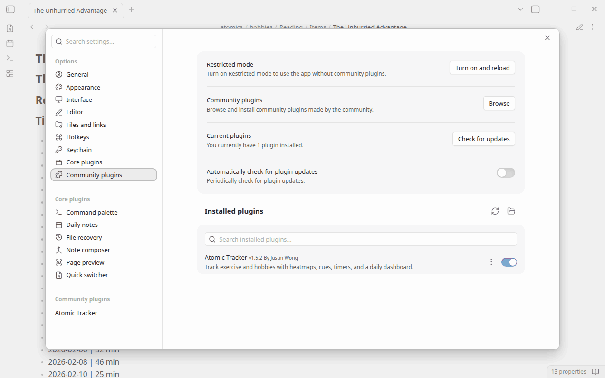

### Manual install from a GitHub Release

1. Open the [latest GitHub Release](https://github.com/justinw0ng/obsidian-atomic/releases/latest).
2. Download **`main.js`**, **`manifest.json`**, and **`styles.css`**.
3. Copy those three files into `<vault>/.obsidian/plugins/atomic-tracker/`. Create the folder if it does not exist. Do not use **Source code (zip)**.

---

## Open today’s note

1. Command palette → **Create today's daily note**.
2. Check the book shelf, the habit buttons, the year of heatmaps, and today’s sessions.
3. Press a habit button to create **today’s session note** (gym or golf) or a **reading item**.

Atomic writes today’s note at the Daily Notes **New file location** (vault root if unset), using the Daily Notes date format (`YYYY-MM-DD` if unset).

To reuse that layout every day, run **Create daily note template**. That writes the Daily Notes **Template file location** if set; otherwise `Atomic daily note.md` in the Templates folder, or the vault root when that folder is unset (Obsidian `{{date}}` tokens). Setup is in [examples/README.md](../examples/README.md#use-the-daily-note-template). You can still copy [`examples/daily-notes/2026-08-11.md`](../examples/daily-notes/2026-08-11.md) if you want a filled sample.

Turn on **Gym**, **Golf**, and **Reading** under **Settings → Atomic Tracker** if those buttons are missing. One color picker per habit sets the four heatmap shades.

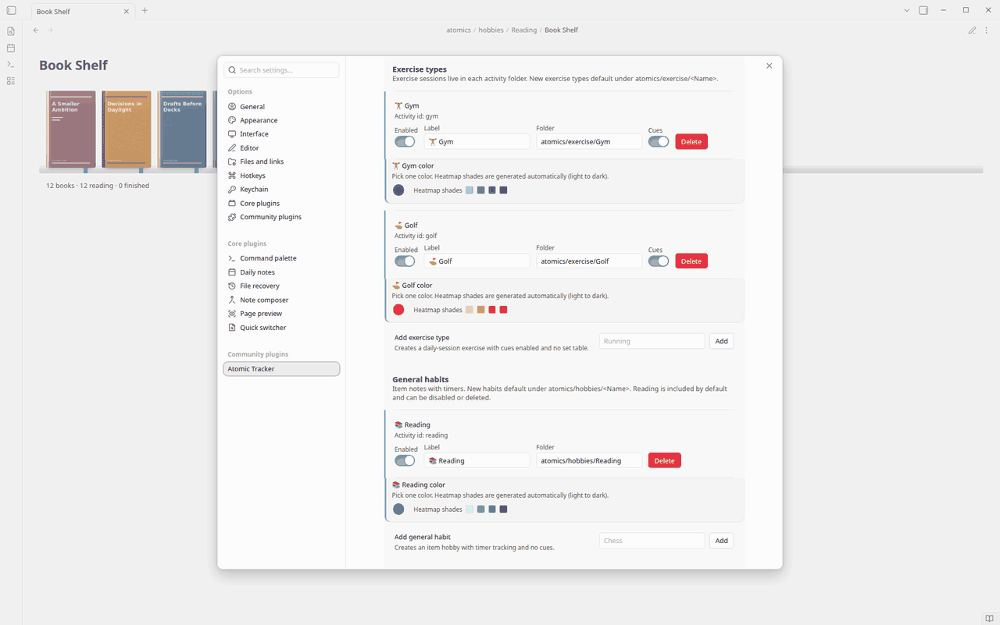

The example note is this:

````markdown
# Tuesday, August 11, 2026

```atomic-bookshelf
activity: reading
```

## Track your activities today!

```atomic-actions
```

```atomic-heatmap
year: 2026
activity: gym, golf, reading
rows: 2
columns: 2
```

```atomic-today
```
````

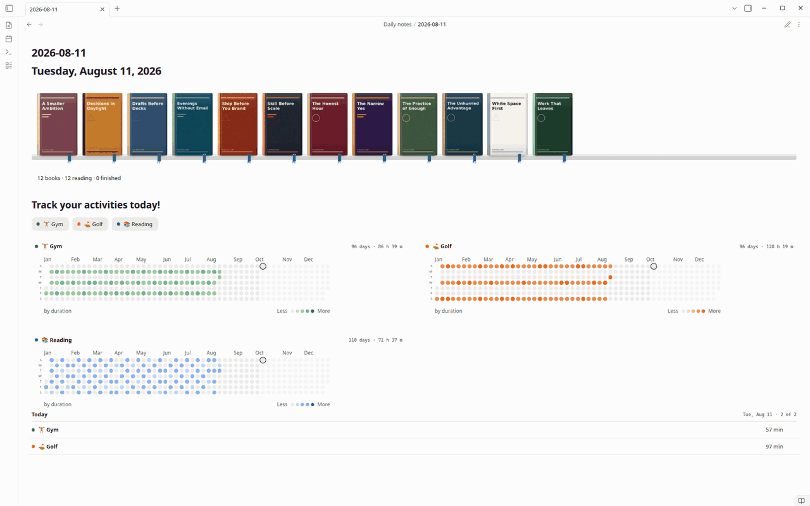

---

## Heatmap

1. Stop a timer. The year of dots on today’s note fills in.
2. Darker dots are more minutes. Point at a dot to read that day. Today is the ring.
3. Click a filled dot to open that session.

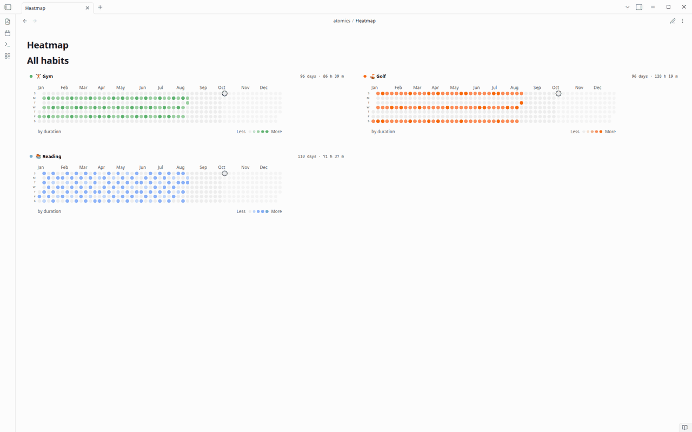

`atomic-today` lists each habit for this date. Click a row that has a session to open that note.

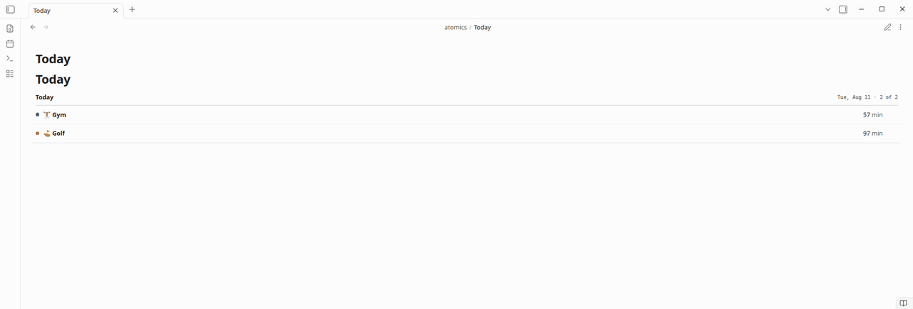

---

## Dashboard

1. Command palette → **Open dashboard**, or open `atomics/Dashboard.md`.
2. Step the year. Read the totals row, then one row per habit.
3. Use the links for cue pages, Bases, and the book shelf. Click a recent session to open that note. The monthly chart is under the rows.

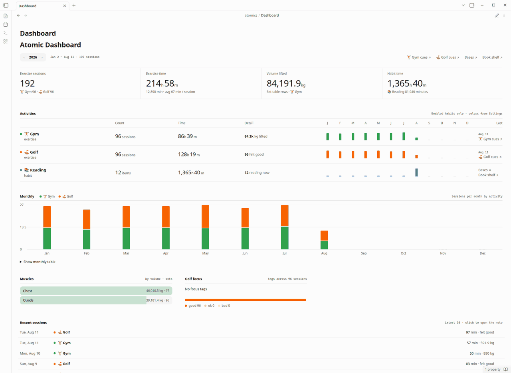

---

## Timer

Gym, golf, and reading notes share one timer well.

1. Press **Start** when you begin.
2. While it runs, the well shows **Running · since** and a clock.
3. Press **Stop** to save the minutes. Press **Discard** to drop this run.

On a gym or golf session note, **Stop** writes `duration_min`. Those minutes show on the heatmap.


---

## Gym log

1. On the gym session note, open the exercise field and pick an exercise. Choose **New exercise…** if it is not listed.
2. Enter weight and reps. Notes are optional.
3. Click **Add set**. A row appears in the table. You do not type the table yourself.

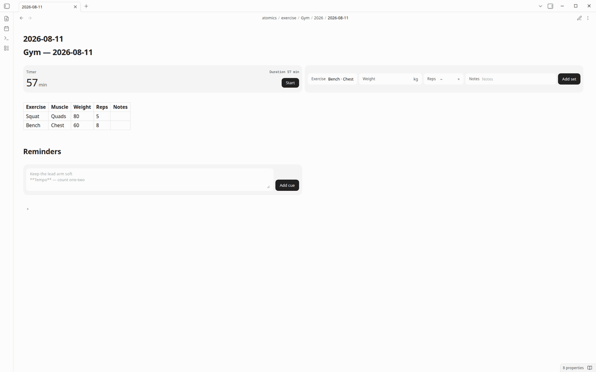

---

## Cues

1. On the same session note, type a short reminder.
2. Click **Add cue**. Atomic saves it on that note.
3. Open `{folder}/Cues.md` (for example `atomics/exercise/Gym/Cues.md`) to see the cards.

Atomic creates that host when it is missing — when the plugin loads, when you open a dashboard **Cues** link, or when you run **Atomic Tracker: Create cues notes**. Existing hosts are left unchanged. A new host uses `atomic-cues` with `activity:` set to the exercise id.

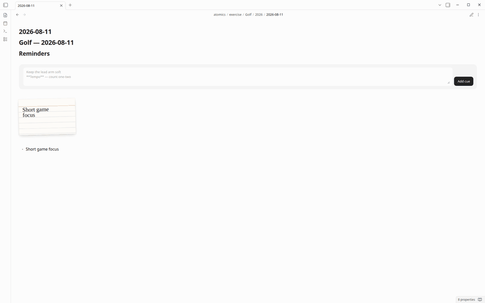

On a gym session, a golf session, or a reading item, some properties are a dropdown.

1. Open the note. Properties are at the top.
2. Read location, felt, status, or weight unit. You see one value and a chevron.
3. For location, choose **Custom…** when the place is not in the list.

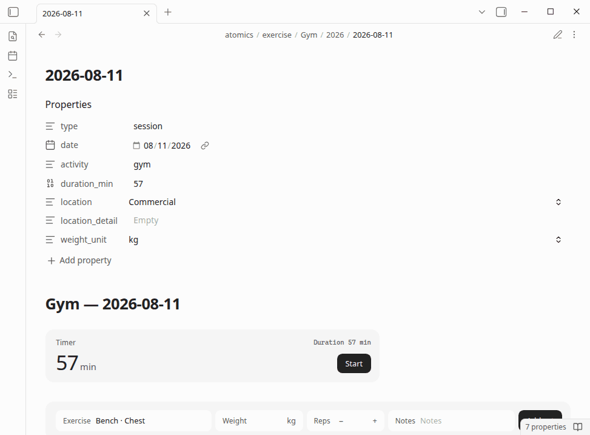

---

## Reading

1. From today’s note, press **Reading**, or click a book on the shelf.
2. On the book note, press **Start**.
3. Press **Stop**. Stop asks for a short note. **Discard** drops the run.

Those minutes fill the reading heatmap. The idle well shows the saved total.

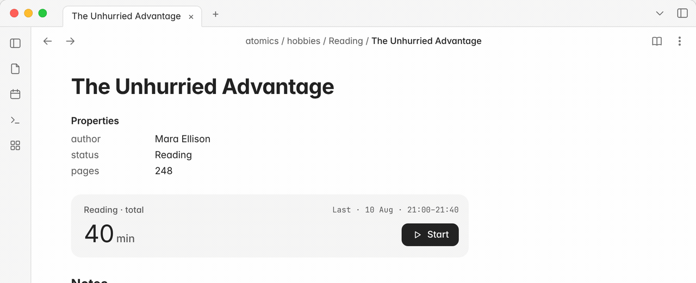

---

## Cue cards and the shelf

1. Hover a card on desktop to lift it and show the date.
2. Click it (or tap on a phone) to enlarge it in the center.
3. Click outside, press Esc, or click the large card again to put it back.

On a narrow pane the list shows four lines of each cue. The first line sits on the first rule. The card in the list does not grow. The large card grows with the writing and scrolls if it is taller than the window. The rest of the page blurs. The page does not dim.

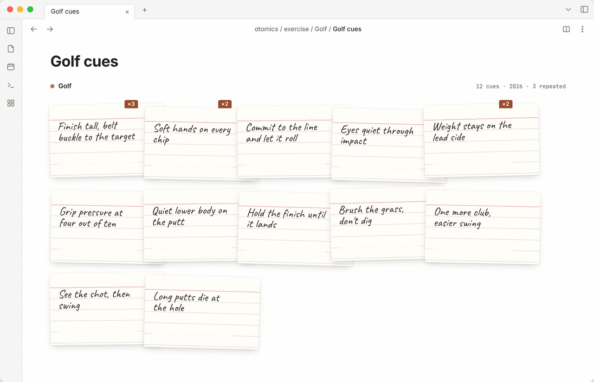

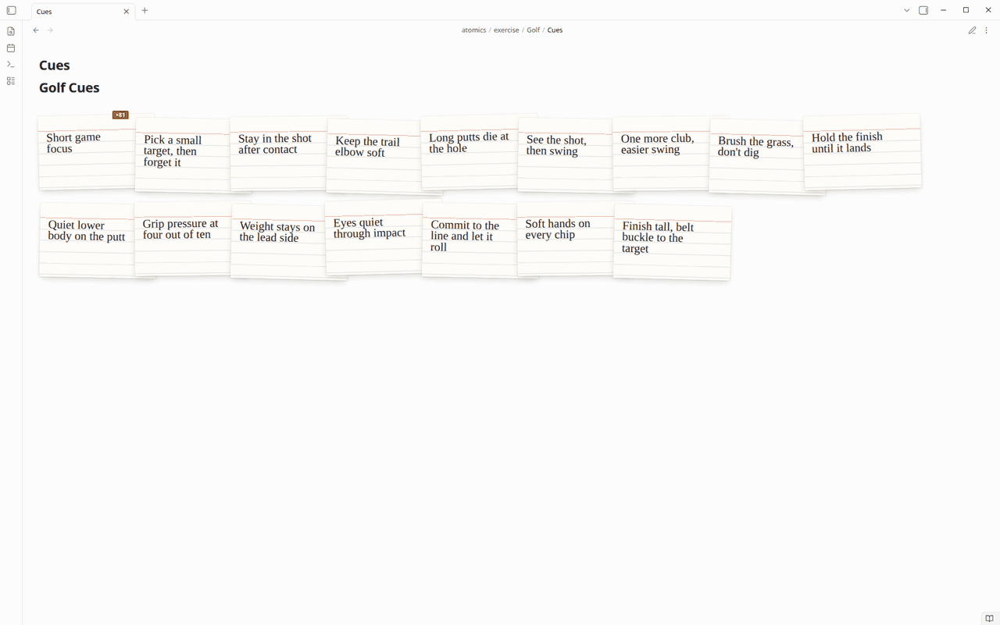

The shelf on today’s note is your books.

1. Hover a cover. The book pops up. The line under the shelf names the book.
2. Click the cover. The cover opens.
3. Click the book again to open the note.

On a phone, tap once to lift the book. Tap again to open the note.

A cover you add fills the book. If the picture is wider or narrower than the book, it scales until the book face is full.

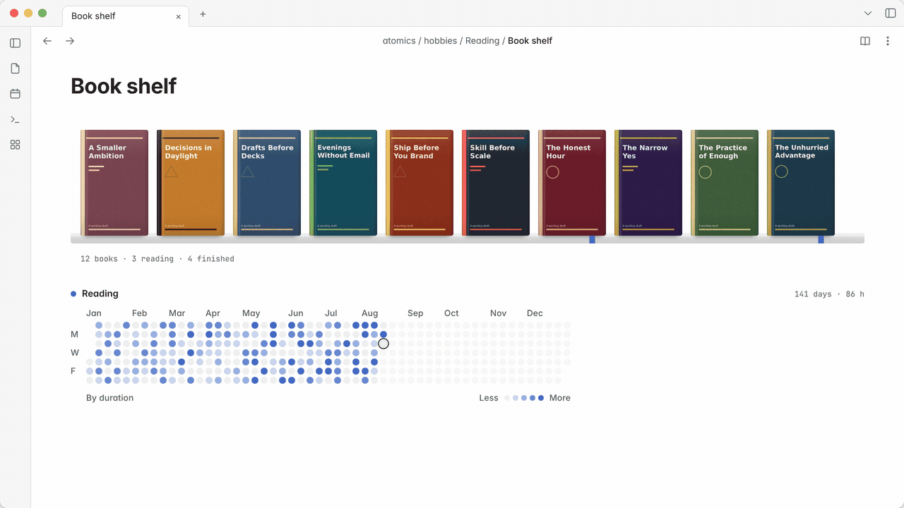

---

## If something looks wrong

| Problem | Fix |
|---------|-----|
| Plugin not listed | Confirm `main.js`, `manifest.json`, and `styles.css` are under `.obsidian/plugins/atomic-tracker/` and reload plugins. Do not use a source zip. |
| Restricted mode | Turn on community plugins in Settings |
| Empty heatmap or today list | Enable the habit in settings, then stop a session timer or a reading timer |
| Codeblock shows raw text | Enable the plugin and use Reading view |

---

## Privacy

- All data stays in your vault as markdown.
- The plugin does not call home. An `http(s):` book `cover` URL is loaded by Obsidian like any other remote image in a note.
